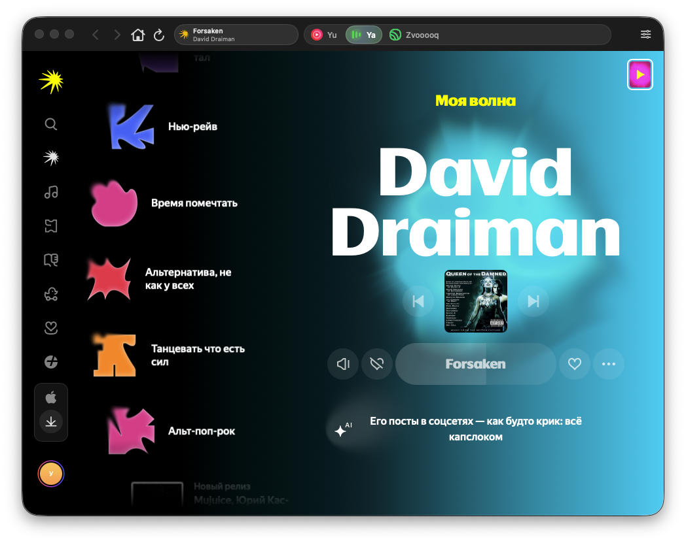
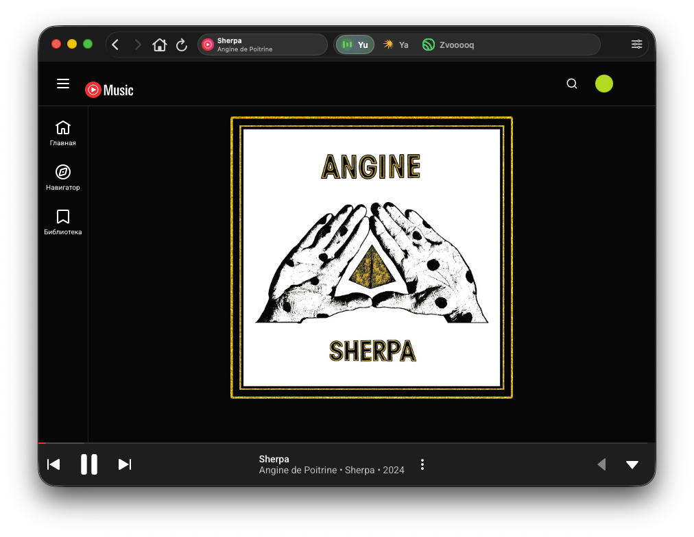
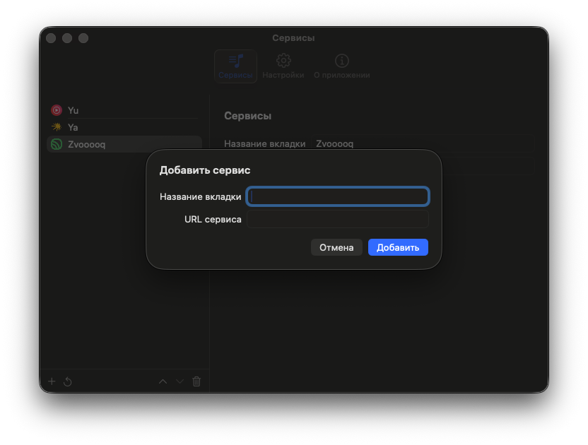
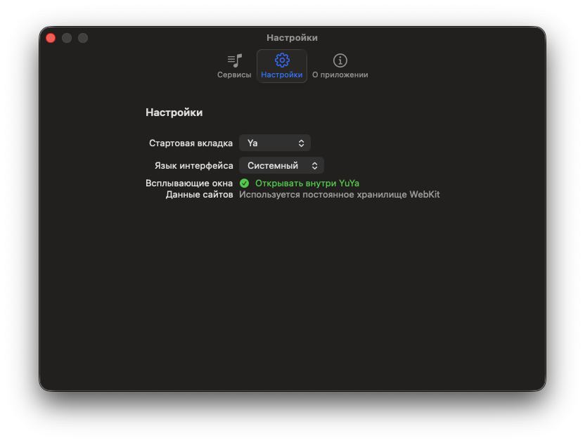
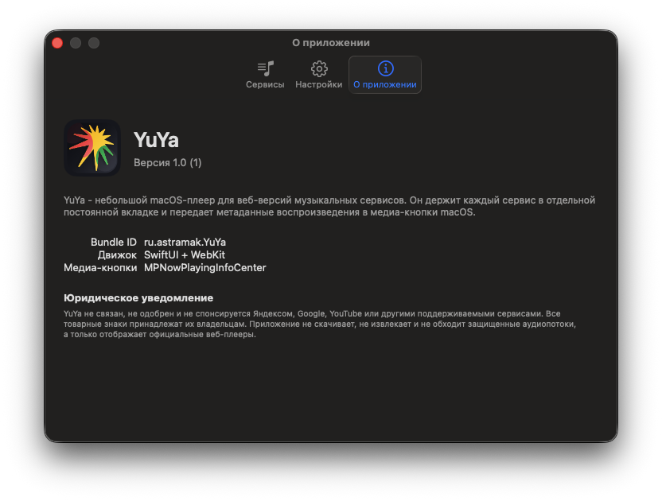
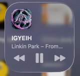
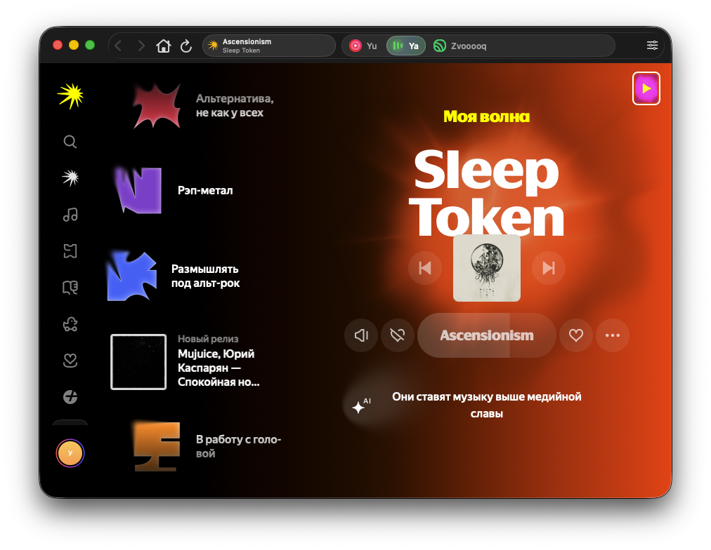

# YuYa

<p align="center">
  
</p>

<p align="center">
  <strong>Native macOS shell for web music services.</strong><br>
  Yandex Music, YouTube Music, Zvuk, and any custom web player in one persistent app window.
</p>

<p align="center">
  
  
  
  
</p>

YuYa is a small macOS music player wrapper built with SwiftUI, AppKit, and WebKit. It keeps each music service in its own persistent `WKWebView`, so switching between services does not reset the page, queue, login session, or current screen.

The app does not download, extract, proxy, or bypass protected audio streams. It displays official web players and connects playback metadata to macOS media controls.

## Screenshots

<p align="center">
  
</p>

<p align="center"><em>Main window: native toolbar, persistent service tabs, and the official web player inside YuYa.</em></p>

<p align="center">
  
</p>

<p align="center"><em>YouTube Music runs as a separate tab and keeps its state while switching services.</em></p>

<table>
  <tr>
    <td width="50%">
      
    </td>
    <td width="50%">
      
    </td>
  </tr>
  <tr>
    <td align="center"><em>Adding a custom service</em></td>
    <td align="center"><em>App settings</em></td>
  </tr>
</table>

<table>
  <tr>
    <td width="75%">
      
    </td>
    <td width="25%" align="center">
      
    </td>
  </tr>
  <tr>
    <td align="center"><em>About screen and legal notice</em></td>
    <td align="center"><em>macOS media controls</em></td>
  </tr>
</table>

<p align="center">
  
</p>

## Features

- Native macOS window chrome with compact toolbar controls.
- Persistent tabs for each service: switch without recreating web views.
- Built-in defaults for YouTube Music and Yandex Music.
- Custom services: add a display name and URL in Settings.
- Favicon loading for service tabs and playback indicators.
- macOS Control Center integration through `MPNowPlayingInfoCenter`.
- Remote media commands through `MPRemoteCommandCenter`.
- One active playback source: starting playback in one service pauses the others.
- Cookies, sessions, and last URLs are stored through WebKit's persistent data store.
- Russian and English interface language options.

## Supported Services

Built in:

- YouTube Music
- Yandex Music

Known custom-service use cases:

- Zvuk
- Other web music players with ordinary browser playback

Custom services are best-effort. If a service blocks embedded WebKit browsers, uses unusual popup auth, or relies on browser-specific DRM behavior, it may need service-specific handling.

## Architecture

YuYa is intentionally small and native:

- `SwiftUI` for the app shell, settings, and toolbar controls.
- `AppKit` for window lifecycle and native `NSToolbar` behavior.
- `WKWebView` for isolated persistent service tabs.
- JavaScript bridge for playback snapshots, capabilities, and remote commands.
- `MediaPlayer` APIs for macOS Now Playing and media keys.

The main state is owned by `AppModel`, while each service is represented by `ServiceWebViewModel`.

## Build and Distribution

Requirements:

- macOS
- Xcode with Swift 5 support

Debug build for development:

```sh
xcodebuild build \
  -scheme YuYa \
  -configuration Debug \
  -destination 'platform=macOS'
```

Run tests:

```sh
xcodebuild test \
  -scheme YuYa \
  -destination 'platform=macOS'
```

Unsigned Release build for local testing:

```sh
xcodebuild build \
  -scheme YuYa \
  -configuration Release \
  -destination 'platform=macOS' \
  -derivedDataPath build/DerivedData \
  CODE_SIGNING_ALLOWED=NO
```

The built app will be here:

```sh
build/DerivedData/Build/Products/Release/YuYa.app
```

This is useful for local testing, but it is not suitable for public distribution. macOS will warn users about an unsigned app.

### Developer ID release

Distribution outside the Mac App Store requires an Apple Developer account, a `Developer ID Application` certificate, and configured `notarytool` credentials.

Archive:

```sh
xcodebuild archive \
  -scheme YuYa \
  -configuration Release \
  -destination 'generic/platform=macOS' \
  -archivePath build/YuYa.xcarchive \
  DEVELOPMENT_TEAM=YOUR_TEAM_ID
```

Export signed `.app`:

```sh
xcodebuild -exportArchive \
  -archivePath build/YuYa.xcarchive \
  -exportPath build/export \
  -exportOptionsPlist Packaging/ExportOptions.DeveloperID.plist
```

DMG:

```sh
hdiutil create \
  -volname "YuYa" \
  -srcfolder build/export/YuYa.app \
  -ov \
  -format UDZO \
  build/YuYa.dmg
```

Notarization:

```sh
xcrun notarytool submit build/YuYa.dmg \
  --keychain-profile "notarytool-profile" \
  --wait

xcrun stapler staple build/YuYa.dmg
```

Create the notarization profile if needed:

```sh
xcrun notarytool store-credentials "notarytool-profile" \
  --apple-id "APPLE_ID_EMAIL" \
  --team-id "YOUR_TEAM_ID" \
  --password "APP_SPECIFIC_PASSWORD"
```

## Notes

- Safari passwords and Safari website sessions are not shared with `WKWebView` apps. YuYa has its own WebKit storage.
- Some login providers may still decide that embedded browsers are not allowed.
- The app keeps playback alive when the main window is closed; quitting the app stops everything.
- macOS media metadata depends on what the web player exposes through Media Session or standard HTML media elements.

## Legal

YuYa is not affiliated with, endorsed by, or sponsored by Yandex, Google, YouTube, Spotify, Zvuk, or any other supported service. All trademarks, service names, logos, and media content belong to their respective owners.

YuYa does not download, extract, decrypt, proxy, or bypass protected audio streams. It only embeds official web players in a native macOS wrapper.
